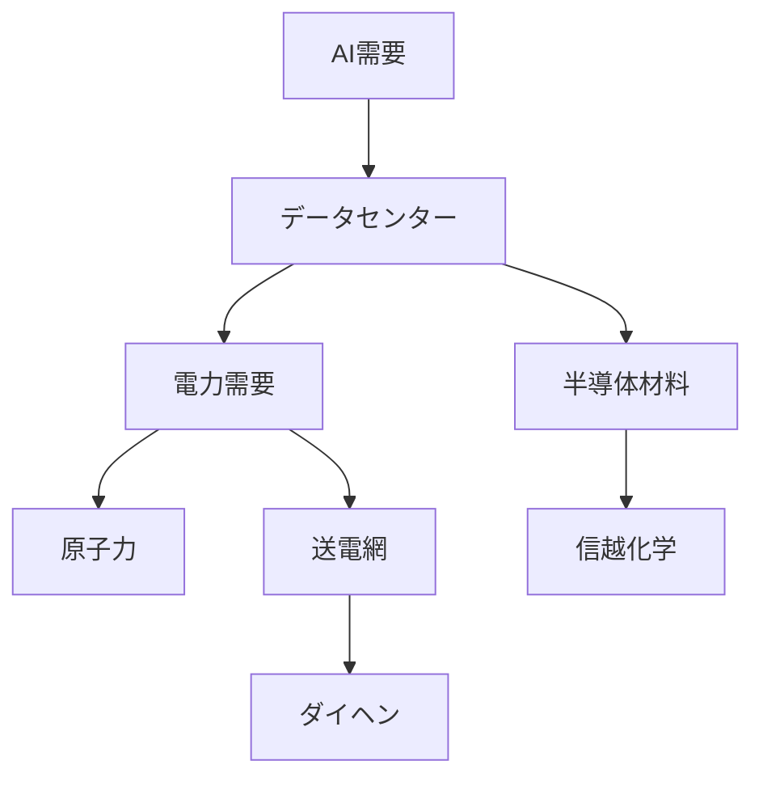

# Knowledge Graph

テーマ、需要、供給制約、技術、部材、企業の因果関係を記録します。

```mermaid
flowchart TD
  AI[AI需要] --> DC[データセンター]
  DC --> Power[電力需要]
  Power --> Nuclear[原子力]
  Power --> Grid[送電網]
  Grid --> Daihen[ダイヘン]
  DC --> Materials[半導体材料]
  Materials --> ShinEtsu[信越化学]
```
