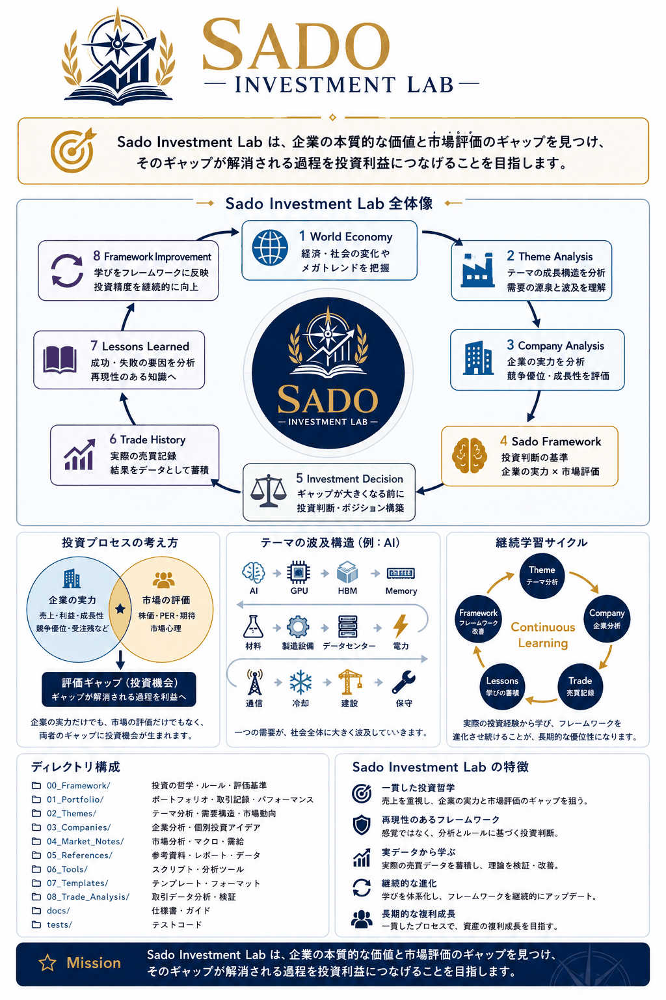

# Sado Investment Lab

## Mission

Sado Investment Lab は、企業の本質的な価値と市場評価のギャップを見つけ、そのギャップが解消される過程を投資利益につなげることを目指します。

  

株式投資の思想、判断基準、企業分析、市場観測、投資日記、仮説検証を蓄積する個人研究リポジトリです。

Codexは作業開始時に必ず [Current_Status.md](Current_Status.md) を読みます。

## Structure

- `00_Framework/`: 投資思想・ルール・評価軸
- `01_Portfolio/`: 保有・監視・売買・成績
- `02_Themes/`: 投資テーマ
- `03_Companies/`: 分野別企業分析
- `04_Market/`: 市場観測
- `05_Decision_Log/`: 意思決定と振り返り
- `06_Research/`: IR・決算・ニュース・業界調査
- `07_Templates/`: 標準テンプレート
- `08_KnowledgeGraph/`: テーマと企業の因果関係
- `09_Hypothesis/`: 投資仮説と検証

## Rules

1. 事実、解釈、仮説を分ける
2. 判断理由と反証条件を残す
3. 仮説は期限を決めて検証する
4. 重要な変更後はCurrent Statusを更新する

